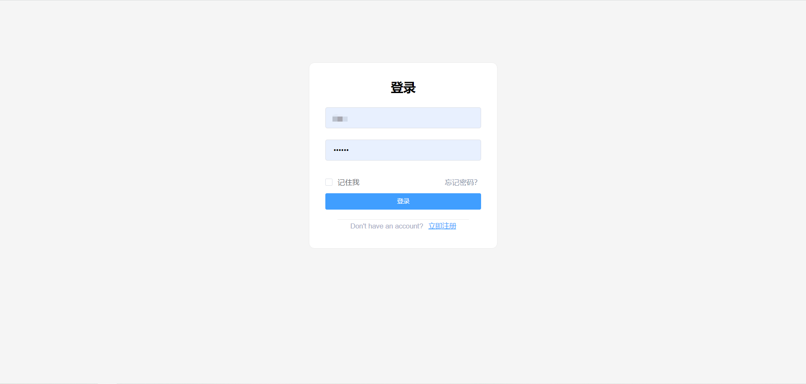
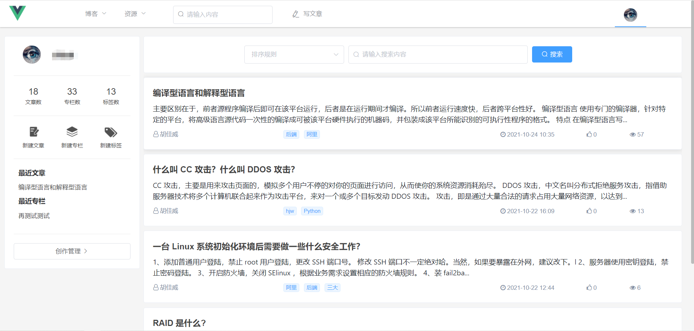
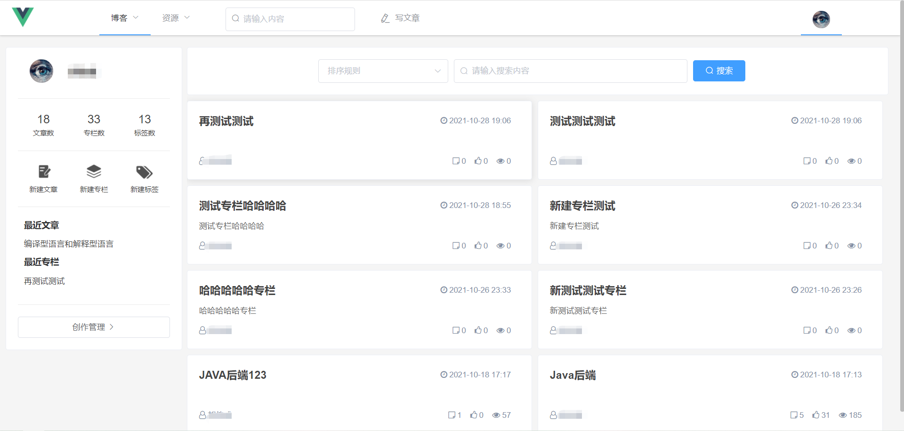
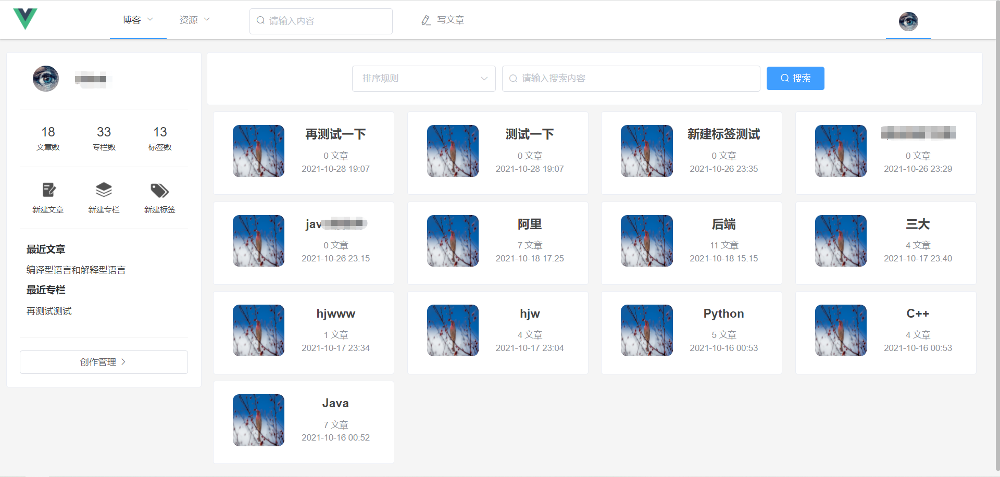
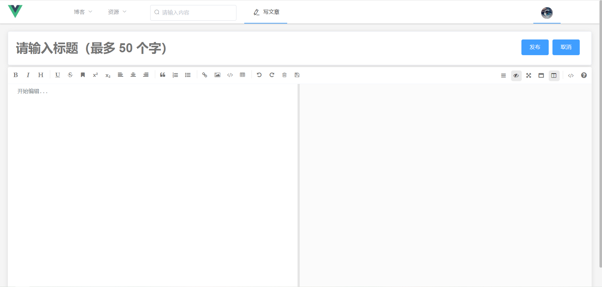
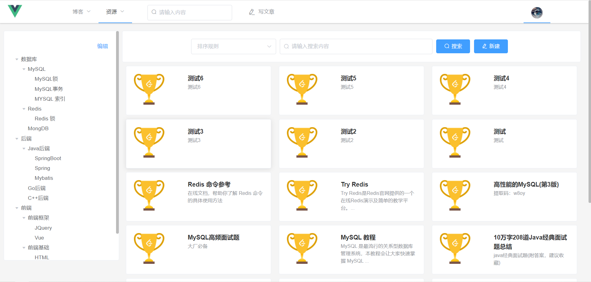
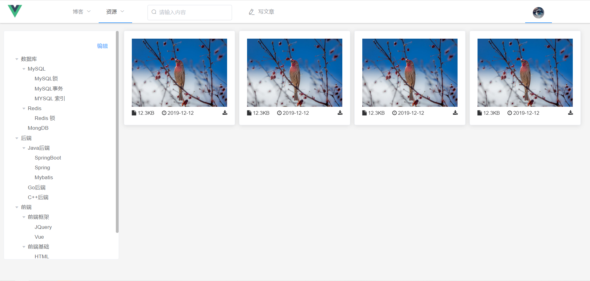
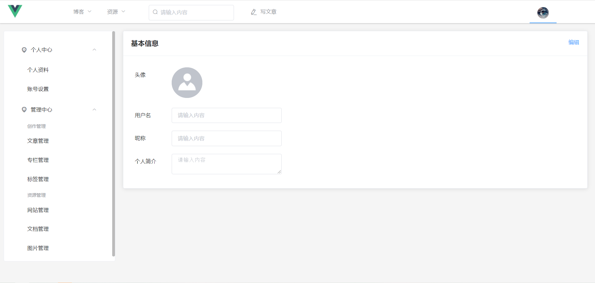
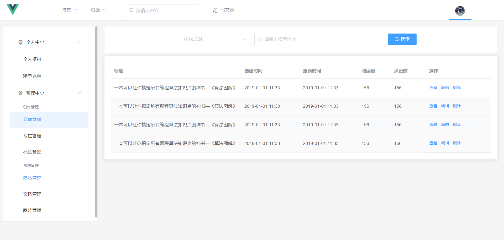

## RecordSpace 
个人博客系统-记录空间

- 前端采用Vue、VueX、VueRouter、element-ui
- 后端采用Springboot、MySQL、Mybatis-plus
- 支持代码生成器

### 系统功能
|    | 功能 | 描述 |
|----|----|----|
|   |博文|展示发布的博客|
|   |专栏|展示发布的专栏|
|   |标签|展示发布的标签|
|   |网站资源|展示上传的网站资源|
| 🚀 |文档资源|展示上传的文档资源|
| 🚀 |图片资源|展示上传的图片资源|
| 🚀 |个人中心|修改个人信息|
| 🚀 |管理中心|管理发布的博客和上传的资源|

### 项目结构
* record-space-backend 后端代码
    * common 公共
        * constant 常量
        * exception 全局异常
        * response 结果封装
    * config 配置
    * controller 处理url请求
    * domain 实体类
    * handler 处理器
    * mapper 操作数据库接口
    * service 业务处理
    * shiro 认证
    * util 工具类
* record-space-frontend 前端代码
    * api 后端接口
    * assets 静态资源
    * component 组件
    * pattern 正则
    * router 路由
    * store 状态管理
    * views 视图
    
    
### 项目运行
* mysql 
    * 建立tb_record_space数据库，字符集utf8，排序规则utf8_general_ci
    * 运行tb_record_space.sql 文件
    
* 后端
    * 修改application.properties 文件
    
* 前端
    * npm install
    * npm run serve
    
    
### 项目截图
* 登录/注册

* 博文

* 专栏

* 标签

* 写文章

* 网站资源

* 文档资源

* 图片资源

* 个人中心

* 管理中心

